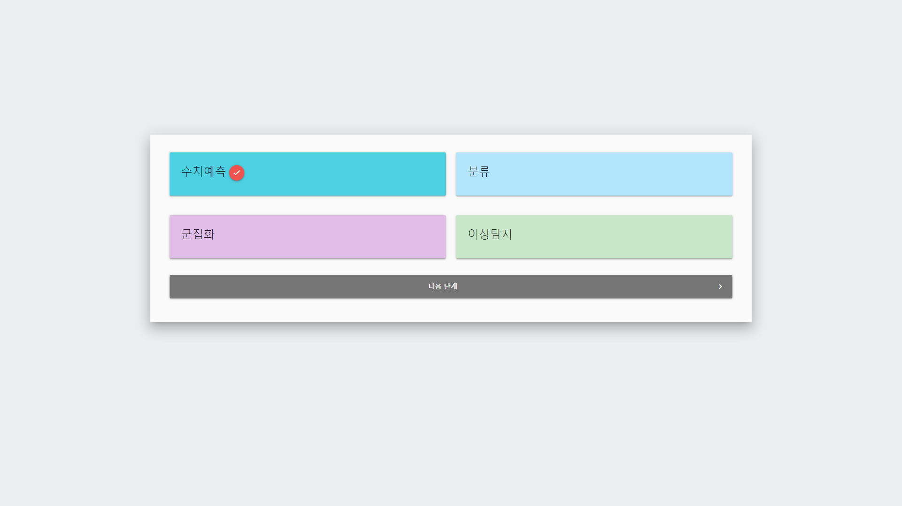
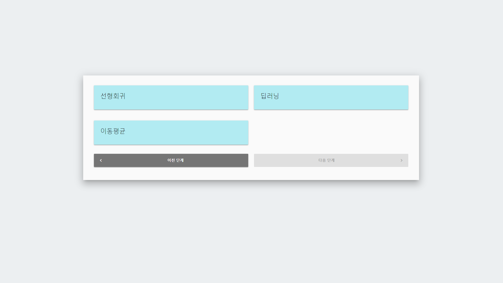
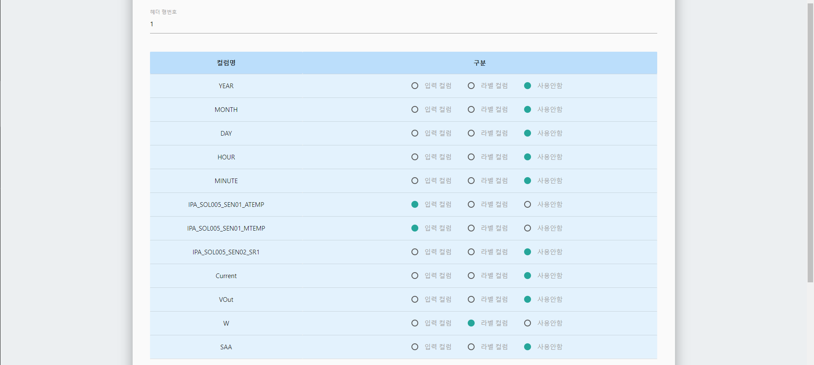
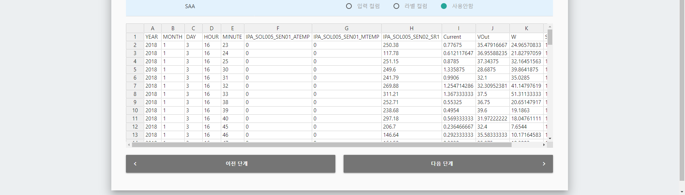
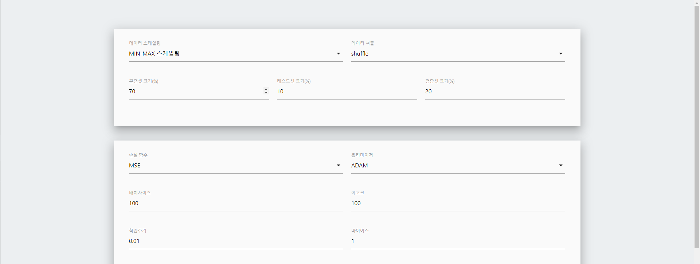
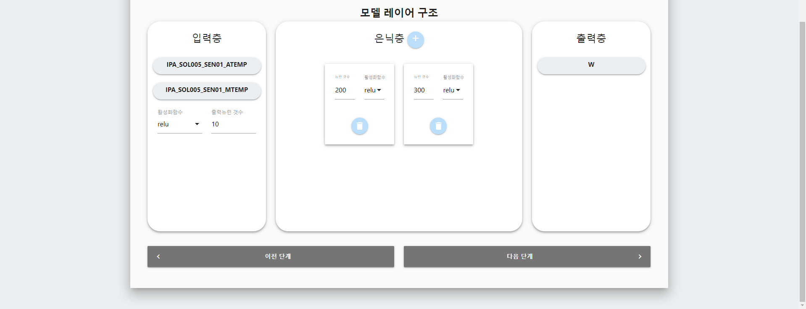
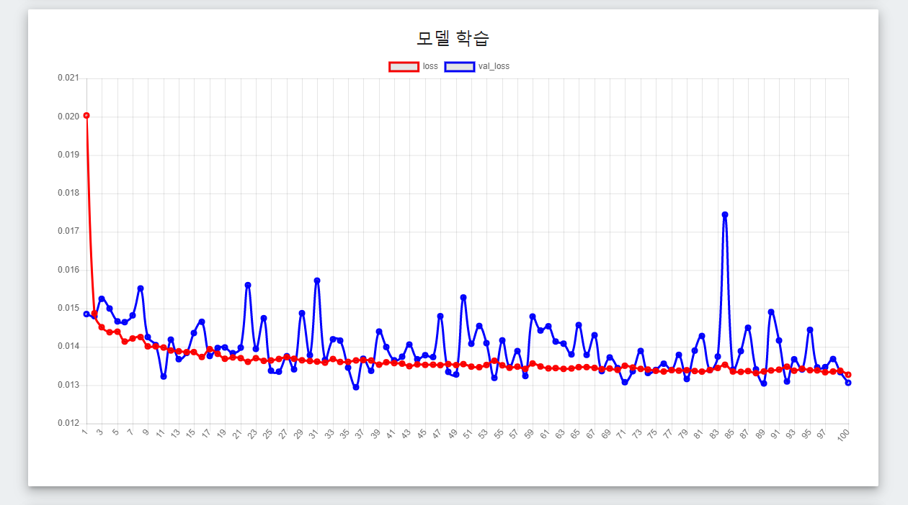
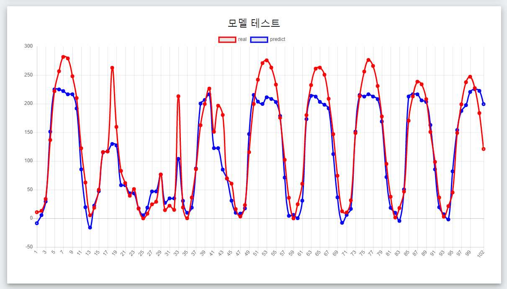
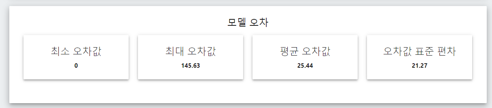

# 1.프로젝트 개요
머신러닝을 비 개발자도 쉽게 사용할 수 있도록 만든 머신러닝 웹 입니다.
현재 수치입력->수치예측 기능밖에 없지만 추후 이미지 인식 및 여러 기법을 추가할 예정입니다.

# 필수요소
npm

# 파이썬 개발 환경
- python3.7
- tensorflow
- keras
- SocketIO
- sklearn
- numpy
- pandas

# 노드 개발 환경
- express
- python-shell
- socket.io

# 실행방법
- web 폴더로 이동

- npm start

- # 목적 선택 

- # 기법 선택 

- # 데이터 세트 선택
- 데이터 세트는 엑셀, csv 형식을 지원합니다.
- 반드시 컬럼명이 존재해야합니다.
- 데이터는 3만 ROW가 넘어갈 경우 웹 브라우저가 동작을 멈출 수 있습니다.
- 데이터 세트를 지정한 후, 시트를 선택합니다. 

- 시트가 선택 되었으면 컬럼명이 들어있는 행번호를 기입합니다.
- 행번호 기입 후, 컬럼 테이블이 생성되어지면 입력 컬럼과 라벨컬럼을 지정합니다.
- 현재 버전에서는 라벨컬럼은 1개, 입력 컬럼은 N개가 가능합니다.
- 입력컬럼은 머신러닝의 Input 라벨컬럼은 머신러닝의 Output (예측하고자 하는것) 입니다.

- # 머신러닝 설정 - 1

- 데이터 스케일링을 통해 데이터 값의 범위를 어떻게 축소시킬지 선택합니다. 만약 MIN-MAX 스케일링 기법을 사용한다면 데이터 값의 범위는 0에서 1로 축소 됩니다.
- 데이터 셔플은 데이터셋의 순서를 섞을지 말지 선택하는 옵션입니다.
- 훈련셋은 머신러닝의 학습에 사용될 데이터셋입니다. 훈련셋 크기를 지정하여 학습에 사용될 데이터의 양을 조절할 수 있습니다.
- 테스트셋은 학습을 종료한 후, 모델을 평가, 테스트하기 위한 세트입니다. 테스트셋 크기를 지정하여 테스트에 사용될 데이터의 양을 조절할 수 있습니다.
- 검증셋은 머신러닝의 학습 도중 모델이 잘 학습되고 있는지 검증에 사용되는 데이터 세트입니다. 데이터셋 크기를 지정하여 검증에 사용될 데이터의 양을 조절할 수 있습니다.
- 손실함수는 오차를 계산하는 함수를 의미합니다. 머신러닝 모델은 손실(loss) 즉 오차를 줄이는 방향으로 학습하게 됩니다. 수치입력 수치예측 모델에서 주로 사용하는 손실함수로는 MSE(평균제곱오차)가 있습니다.
- 옵티마이저는 모델 최적화를 위해 사용되는 함수를 의미합니다. 수치입력 수치예측 모델에서는 주로 Adam을 사용합니다.
- 에포크는 학습세트 전체를 학습하는 횟수 입니다.
- 배치사이즈는 한 학습에 사용될 데이터의 크기 입니다.
- 학습주기는 학습 속도를 의미합니다.

- # 머신러닝 설정 - 2

- 입력층은 예측하고자하는 값 (라벨)을 얻기위해 입력하고자하는 데이터들이 정의되는 레이어입니다. 은닉층 혹은 출력층과의 네트워크를 구성하기위해 활성화 함수와 출력뉴런 갯수를 설정해주세요.
- 은닉층은 입력층을통해 출력층을 만들기위해 사용되는 레이어입니다. 주로 여러 뉴런으로 이루어진 레이어들로 구성됩니다.
- 출력층은 예측하고자 하는 값(라벨)을 구성하는 레이어 입니다.
- 모두 설정했다면 다음 단계로 이동해주세요.

- # 모델 학습
- 이 단계에서는 이전 단계들에서 설정한 데이터, 머신러닝 설정들을 사용해 실제로 모델을 학습합니다.
- 자동으로 node서버 내부에 존재하는 python 프로그램을 실행시켜 동작하며 웹 클라이언트와 소켓통신을 통해 실시간 연동 됩니다.
- 모델이 학습되는 과정을 그래프로 실시간 확인이 가능합니다. 
- 모델 학습이 완료되고나면 이전 단계에서 지정한 테스트세트를 통해 모델을 테스트해봅니다. 실제 라벨값과 예측 라벨값을 하나의 그래프로 출력하여 만들어진 모델이 얼마나 정확한지 시각적으로 확인이 가능합니다. 
- 모델을 평가하기위해 최종적으로 모델의 오차값을 출력합니다. 실제와 예측간 최소오차, 최대오차, 평균오차, 표준편차를 구하여 출력해줍니다. 
